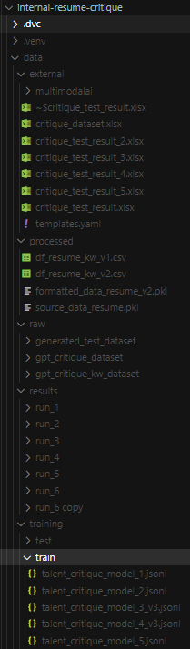

# Resume Critique

Finetuning Llama 3.1 for Resume Feedback application

6 models finetuned for giving feedback about each Resume section.

## Models:

### Repo:
 https://huggingface.co/leoitcode

### Model 1:
Resume Introduction Section Feedback

### Model 2:
Resume Summary / Profile Section Feedback

### Model 3:
Resume Keywords / Skills / Competencies Section Feedback

### Model 4:
Resume Work History / Experience Section Feedback
- 'Introduction': A introduction about the work history / experience of the work history / experience.
- 'Achiever': A critique about the achievements and tasks / duties quality in the work history / experience.
- 'Achievements': An array with examples of achievements sentences for improving the resume writing.
- 'Passive': A critique about the use of passive language and expressions in the work history / experience.
- 'Passive Language': An array with examples of passive language verbs, expressions or sentences for improving the resume writing.
- 'Screen Out: A conclusion about the work history / experience.

### Model 5:
Resume General Conclusion Section Feedback

### Model 6:
Resume Work History / Passive Language Section Feedback

## Data Strucutre (DVC):  

